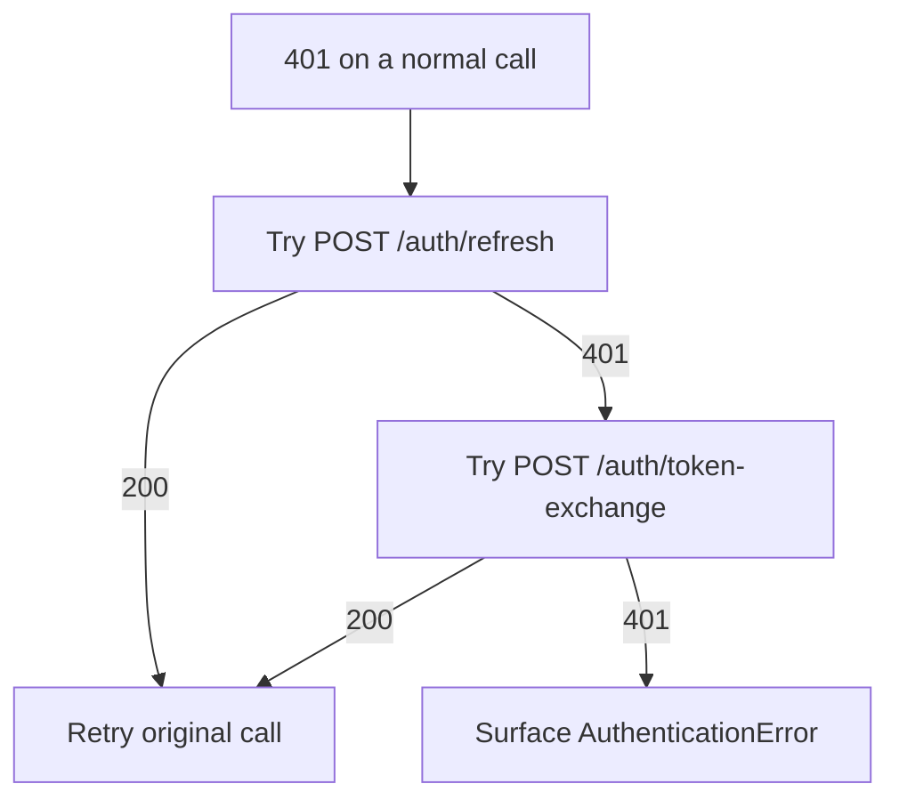

Use this when an `access_token` has expired but the `refresh_token` is still valid. The SDK does this automatically on `401`.

## Body

```json
{
  "refresh_token": "eyJhbGciOiJSUzI1NiIs..."
}
```

<ParamField body="refresh_token" type="string" required>
  A refresh token from `/auth/token-exchange` or a previous refresh.
</ParamField>

## Response — `200`

<ResponseField name="access_token" type="string">
  New 24h access token for the same org and user.
</ResponseField>

<ResponseField name="refresh_token" type="string">
  New 7-day refresh token. Persist it and discard the old one. It stops working as soon as the issuing API key is revoked.
</ResponseField>

<ResponseField name="token_type" type="string">
  Always `"bearer"`.
</ResponseField>

<ResponseField name="expires_in" type="number">
  Lifetime of the new access token in seconds.
</ResponseField>

## What carries over

| Claim | After refresh |
| --- | --- |
| `org_id`, `user_id` | Kept |
| `act` (minted for a specific user) | Kept — the token stays locked to that user |
| `roles` | Kept, limited to the issuing key's current scopes (never widened) |
| `session_id` | Kept |

<Warning>
  Refresh checks the API key that issued the original token. If that key has been revoked, `/auth/refresh` returns `401` — exchange a live key again. Refresh tokens issued before 2026-09-14 don't identify their key and also return `401`; the SDK re-exchanges automatically when it holds an `api_key`.
</Warning>

## Example

<CodeGroup>
```bash cURL
curl -X POST https://api.getmetacognition.com/auth/refresh \
  -H 'content-type: application/json' \
  -d '{"refresh_token":"eyJ..."}'
```

```python Python
import httpx

resp = httpx.post(
    "https://api.getmetacognition.com/auth/refresh",
    json={"refresh_token": refresh_token},
    timeout=10,
)
tokens = resp.json()
```
</CodeGroup>

## When refresh fails

An expired, malformed, or wrong-type token returns `401`. Fall back to `/auth/token-exchange` with the API key.



The Python SDK runs this flow on a single `401` when it holds a refresh token or an API key. A client built with only `access_token` raises `AuthenticationError`.
