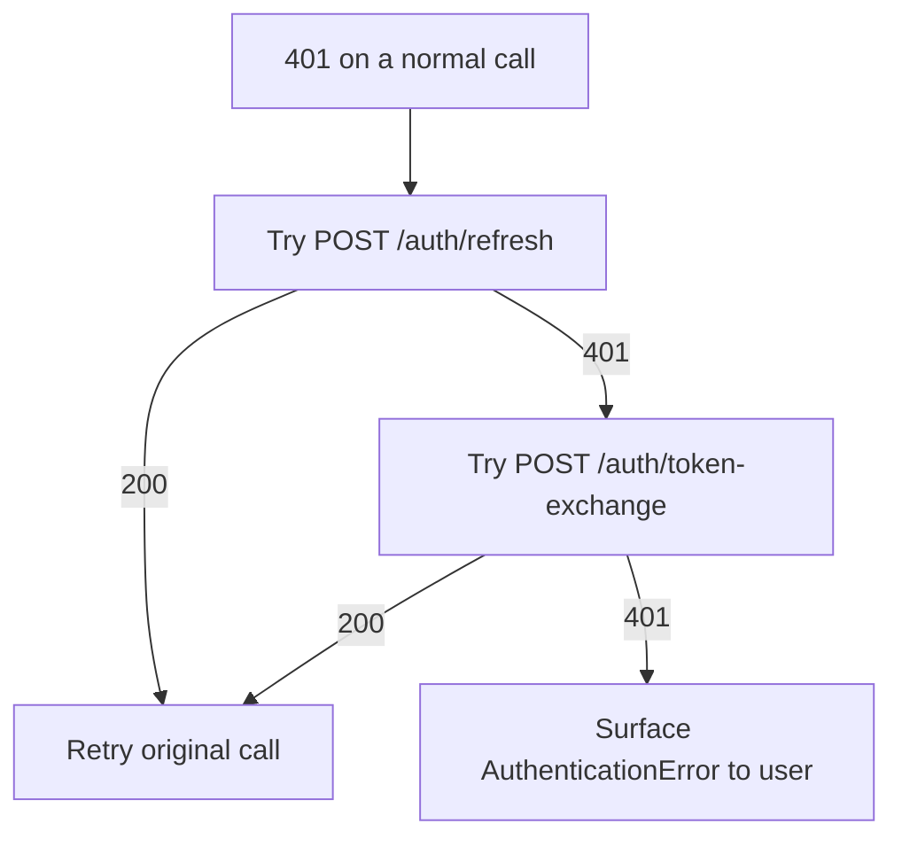

Use this when an `access_token` has expired but the `refresh_token` is still valid. The SDK does this automatically on 401.

## Body

```json
{
  "refresh_token": "eyJhbGciOiJSUzI1NiIs..."
}
```

<ParamField body="refresh_token" type="string" required>
  The refresh token returned by `/auth/token-exchange`.
</ParamField>

## Response — `200`

<ResponseField name="access_token" type="string">
  Fresh 24h JWT.
</ResponseField>

<ResponseField name="refresh_token" type="string">
  Possibly rotated; persist whichever the response returns.
</ResponseField>

<ResponseField name="token_type" type="string">
  Always `"bearer"`.
</ResponseField>

<ResponseField name="expires_in" type="number">
  Lifetime of the new access token in seconds.
</ResponseField>

## Example

<CodeGroup>
```bash cURL
curl -X POST https://api.getmetacognition.com/auth/refresh \
  -H 'content-type: application/json' \
  -d '{"refresh_token":"eyJ..."}'
```

```python Python
import httpx

resp = httpx.post(
    "https://api.getmetacognition.com/auth/refresh",
    json={"refresh_token": refresh_token},
)
tokens = resp.json()
```
</CodeGroup>

## When refresh fails

If the refresh token is itself expired (>7d old) or revoked (the underlying API key was revoked), `/auth/refresh` returns `401`. Fall back to `/auth/token-exchange` with the original API key — or, if the API key is also gone, surface a re-login flow.



The Python SDK runs this entire flow internally on a single 401 response — you only see `AuthenticationError` if the whole chain fails.
