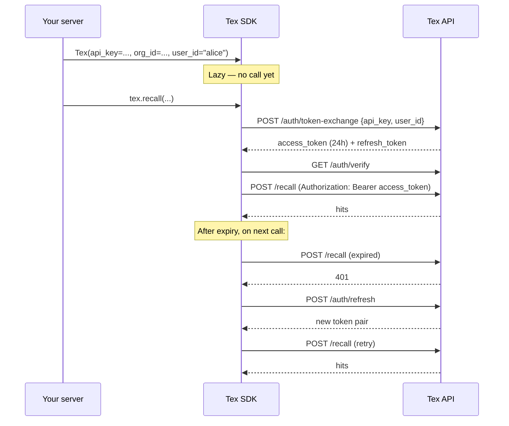

You hold an **API key** on your server. The SDK exchanges it for a short-lived **JWT access token** the first time it's needed and refreshes transparently.

## The auth flow



## What you provide

<Tabs>
  <Tab title="Per-user client (production)">
    ```python
    import os
    from tex import Tex

    alice = Tex(
        api_key=os.environ["TEX_API_KEY"],
        base_url="https://api.getmetacognition.com",
        org_id=os.environ["TEX_ORG_ID"],
        user_id="alice",
    )
    ```

    The SDK makes a single `POST /auth/token-exchange` with `{api_key, user_id}` and receives a token minted **for alice**. Every call — including the Supermemory-compatible `/v3` and `/v4` calls — acts as alice, with alice's team and project scopes.

    - The key needs an **impersonation-capable scope**: `impersonate_user` (also accepted: `tenant:write:any_user`, `agent`, `service`, `system`, `*`). Otherwise the exchange returns `403` and the SDK raises `PermissionDeniedError` explaining why.
    - The minted token carries an `act` claim naming the key. It is locked to alice: it cannot impersonate anyone else.
    - If you pass `org_id`, the SDK checks that the key belongs to that org.

    See [Per-user clients](/sdk/per-user-clients).
  </Tab>
  <Tab title="Key identity">
    ```python
    tex = Tex(
        api_key=os.environ["TEX_API_KEY"],
        base_url="https://api.getmetacognition.com",
        org_id=os.environ["TEX_ORG_ID"],
    )
    ```

    Without `user_id`, the token is for the key's own synthetic identity (`apikey_<first 8 chars of key id>`). Every caller using this client shares one memory. Fine for scripts and single-user tools; use per-user clients for multi-user apps.
  </Tab>
  <Tab title="Bring your own token">
    ```python
    tex = Tex(
        access_token=token_from_your_broker,
        org_id="org_abc",                    # pass explicitly
        user_id="alice",                     # pass explicitly
        base_url="https://api.getmetacognition.com",
    )
    ```

    Use this when a trusted server mints per-user tokens and hands them to a client (for example an on-device app — see the [ReM integration guide](/integrations/rem)).

    <Warning>
      With `access_token`, SDK 1.2.2+ takes `org_id` / `user_id` from `/auth/verify` or the token's claims. On 1.2.0–1.2.1, pass them — `remember` and `recall` without `scope=` send them in the request body, and a missing `org_id` returns `422`. Without a `refresh_token` or `api_key`, an expired token raises `AuthenticationError`; fetch a new token and build a new client.
    </Warning>
  </Tab>
  <Tab title="Org + user login (dev only)">
    ```python
    tex = Tex(
        org_id="org_abc",
        user_id="u_xyz",
        base_url="http://localhost:8000",
    )
    ```

    <Warning>
      With no API key and no token, the SDK calls `POST /auth/login`, which only exists when a self-hosted backend runs with `DEBUG=true`. Production returns `403` and the SDK raises `PermissionDeniedError` pointing you to per-user clients.
    </Warning>
  </Tab>
</Tabs>

## Where to keep the key

<CardGroup cols={2}>
  <Card title="Local dev" icon="laptop">
    `.env` file. Add it to `.gitignore`. Load with `python-dotenv`.
  </Card>
  <Card title="Docker / Kubernetes" icon="boxes-stacked">
    Secret manager → mounted as `TEX_API_KEY` env var.
  </Card>
  <Card title="Serverless" icon="cloud">
    Project environment variables → `TEX_API_KEY`.
  </Card>
  <Card title="GitHub Actions" icon="github">
    Repository secret → exposed via `${{ secrets.TEX_API_KEY }}`.
  </Card>
</CardGroup>

The SDK reads `TEX_API_KEY` and `TEX_BASE_URL` from the environment when `api_key=` / `base_url=` are omitted. `base_url` has no default — without it the constructor raises `ValueError`.

<Warning>
  **Never ship an API key in a device, desktop, or browser app.** A key with an impersonation scope can mint a token for any user in your org. Mint per-user tokens on your server and hand only the access token to the client.
</Warning>

## Org admin routes

Some routes manage the org rather than one user's memory. They need an **org admin token**: exchanged **without** `user_id` from a key with `admin` or `*` (the owner key from signup has `*`). A per-user token inherits the key's roles but is always refused with `403`, so a user can't act as an admin through their own token.

| Route | SDK | Purpose |
| --- | --- | --- |
| `GET` / `POST /me/api-keys` | — | [List and mint keys](/api-reference/account/api-keys) |
| `GET` / `PATCH /me/settings` | — | [Org settings](/api-reference/account/settings) |
| `POST` / `GET` / `DELETE /me/scope-memberships` | `tex.scopes.*` | [Grant and revoke team/project access](/api-reference/account/scope-memberships) |
| `POST /me/deletions`, `GET /me/deletions/{id}` | `tex.deletions.*` | [Delete data and read receipts](/api-reference/account/deletions) |

```python
admin = Tex(api_key=os.environ["TEX_OWNER_KEY"], base_url="https://api.getmetacognition.com")  # no user_id
admin.scopes.grant("alice", "team:fpa-pod")
```

Keep this key on a server you control, separate from your token-broker key (`["impersonate_user"]`), which can't call these routes. `/admin/*` routes are for Tex operators and refuse customer keys.

## Token lifetimes, refresh, and revocation

| Token | Lifetime (production) |
| --- | --- |
| Access token | 24 hours (`expires_in: 86400`) |
| Refresh token | 7 days |

- **Refresh.** `POST /auth/refresh` returns a new access *and* refresh token. The refreshed token keeps `org_id`, `user_id`, the `act` claim (still locked to the same user), the session id, and the key's roles — limited to the key's current scopes, so a refresh never widens access.
- **Revoking a key** stops new token exchanges and makes `/auth/refresh` return `401` for every token minted from that key. Access tokens already issued stay valid until they expire (at most 24 hours).
- There is no per-token revocation endpoint today. To cut access immediately, revoke the key; to limit the 24-hour window, keep refresh tokens on your server and hand clients only short-lived access tokens.

## Rotating keys

<Steps>
  <Step title="Mint key B">
    [Dashboard → API Keys → New key](https://tex-dashboard-ashen.vercel.app/dashboard/keys), or `POST /me/api-keys` with an org-admin token.
  </Step>
  <Step title="Roll out">
    Deploy with `TEX_API_KEY=<key B>`.
  </Step>
  <Step title="Verify">
    Check `last_used_at` on the key (`GET /me/api-keys`).
  </Step>
  <Step title="Revoke key A">
    `DELETE /me/api-keys/{id}`. Clients that already hold tokens keep working until those tokens expire, so this step has no customer-visible impact.
  </Step>
</Steps>

## What happens on a bad key

<CodeGroup>
```python Python
from tex import Tex, AuthenticationError

try:
    tex = Tex(api_key="tex_live_BOGUS", base_url="https://api.getmetacognition.com")
    tex.usage.today()
except AuthenticationError as e:
    print(e.status_code)                # 401
    print(e.details["message"])         # "Invalid API Key"
    print(e.request_id)                 # X-Correlation-ID — quote it in tickets
```

```bash cURL
$ curl -X POST https://api.getmetacognition.com/auth/token-exchange \
    -H 'content-type: application/json' \
    -d '{"api_key": "tex_live_BOGUS"}'

{"error":"HTTP 401","message":"Invalid API Key","details":null,"timestamp":"…","request_id":null}
```
</CodeGroup>

<Note>
  On Tex-native routes the error body's `error` field is `"HTTP <status>"`, so the SDK's `e.message` reads `"HTTP 401"`. The human-readable text is in `e.details["message"]`. See [Handle errors](/sdk/errors).
</Note>

<Card title="Next: users, teams, and scopes" icon="layer-group" href="/concepts/scopes" horizontal>
  How personal and shared memory work.
</Card>
