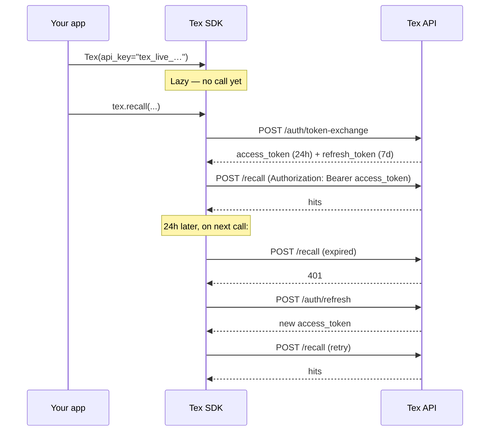

You hold an **API key.** The SDK exchanges it for a short-lived **JWT** the first time it's needed and refreshes transparently. You never see the JWT.

## The auth flow



## What you provide

The constructor accepts any **one** of three auth modes:

<Tabs>
  <Tab title="API key (recommended)">
    ```python
    tex = Tex(
        api_key="tex_live_…",
        base_url="https://api.getmetacognition.com",
    )
    ```
    Default for almost every app. The SDK handles exchange and refresh.
  </Tab>
  <Tab title="Bring your own JWT">
    ```python
    tex = Tex(
        access_token=jwt_from_my_auth_service,
        refresh_token=refresh_jwt,           # optional
        org_id="org_abc",                    # required with BYO-JWT
        user_id="u_xyz",                     # required with BYO-JWT
        base_url="https://api.getmetacognition.com",
    )
    ```

    Useful when you broker auth in a separate service and pass JWTs to your client.

    <Warning>
      Unlike the api-key flow, BYO-JWT does **not** auto-fill `org_id` / `user_id` from `/auth/verify`. Pass them explicitly — every `remember` and `recall` needs them in the request scope.
    </Warning>
  </Tab>
  <Tab title="Org + user login (debug only)">
    ```python
    tex = Tex(
        org_id="org_abc",
        user_id="u_xyz",
        base_url="http://localhost:8000",
    )
    ```

    <Warning>
      `/auth/login` is **disabled** in production (returns 403 unless the integration backend runs with `DEBUG=true`). Use this only for local development against a self-hosted backend. For production apps, use an API key.
    </Warning>
  </Tab>
</Tabs>

## Where to keep the key

<CardGroup cols={2}>
  <Card title="Local dev" icon="laptop">
    `.env` file. Add it to `.gitignore`. Load with `python-dotenv`.
  </Card>
  <Card title="Docker / Kubernetes" icon="boxes-stacked">
    Secret manager → mounted as `TEX_API_KEY` env var.
  </Card>
  <Card title="Vercel / Netlify" icon="cloud">
    Project Environment Variables → `TEX_API_KEY`.
  </Card>
  <Card title="GitHub Actions" icon="github">
    Repository secret → exposed via `${{ secrets.TEX_API_KEY }}`.
  </Card>
</CardGroup>

The SDK reads `TEX_API_KEY` from the environment automatically when `api_key=` is omitted.

## Rotating keys without downtime

<Steps>
  <Step title="Mint key B">
    [Dashboard → API Keys → New key](https://app.getmetacognition.com/dashboard/keys).
  </Step>
  <Step title="Roll out">
    Deploy with `TEX_API_KEY=<key B>`.
  </Step>
  <Step title="Verify">
    Check the dashboard's "last used" column or your own logs.
  </Step>
  <Step title="Revoke key A">
    Click **Revoke** on the old key. Existing JWTs minted from key A keep working for up to 24h, so step 4 has zero customer-visible impact.
  </Step>
</Steps>

## What happens on a bad key

<CodeGroup>
```python Python
from tex import Tex, AuthenticationError

try:
    tex = Tex(api_key="tex_live_BOGUS", base_url="https://api.getmetacognition.com")
    tex.usage.today()
except AuthenticationError as e:
    print(e.status_code)   # 401
    print(e.message)       # "Invalid API key" or similar
    print(e.request_id)    # Quote this when filing tickets
```

```bash cURL
$ curl -X POST https://api.getmetacognition.com/auth/token-exchange \
    -H 'content-type: application/json' \
    -d '{"api_key": "tex_live_BOGUS"}'

{"error":"HTTP 401","message":"Invalid API key","request_id":"…"}
```
</CodeGroup>

## FAQ

<AccordionGroup>
  <Accordion title="Is the JWT scoped to my org?">
    Yes. The JWT contains your `org_id` and `user_id`, and every request is server-side scoped to those values. You cannot fake another org's data — the body's `scope.org_id` is ignored for billing and isolation.
  </Accordion>
  <Accordion title="What if my refresh token expires?">
    Refresh tokens live 7 days. On the next call after expiry the SDK falls back to re-exchanging your API key. Result: zero customer impact for any app left idle ≤ 7 days; one extra round-trip beyond that.
  </Accordion>
  <Accordion title="Can I revoke a single JWT?">
    No — JWTs are stateless. Revoke the API key instead; the JWT will fail to refresh on its next 401 and the client will surface `AuthenticationError`.
  </Accordion>
  <Accordion title="Is the API key the same as the JWT?">
    No. API key (`tex_live_…`) is a long-lived secret you store. JWT (`eyJ…`) is a short-lived token derived from it. SDK handles the conversion; you never need to think about it.
  </Accordion>
</AccordionGroup>

<Card title="Next: scopes" icon="layer-group" href="/concepts/scopes">
  How `org_id` / `user_id` / `session_id` partition memory.
</Card>
