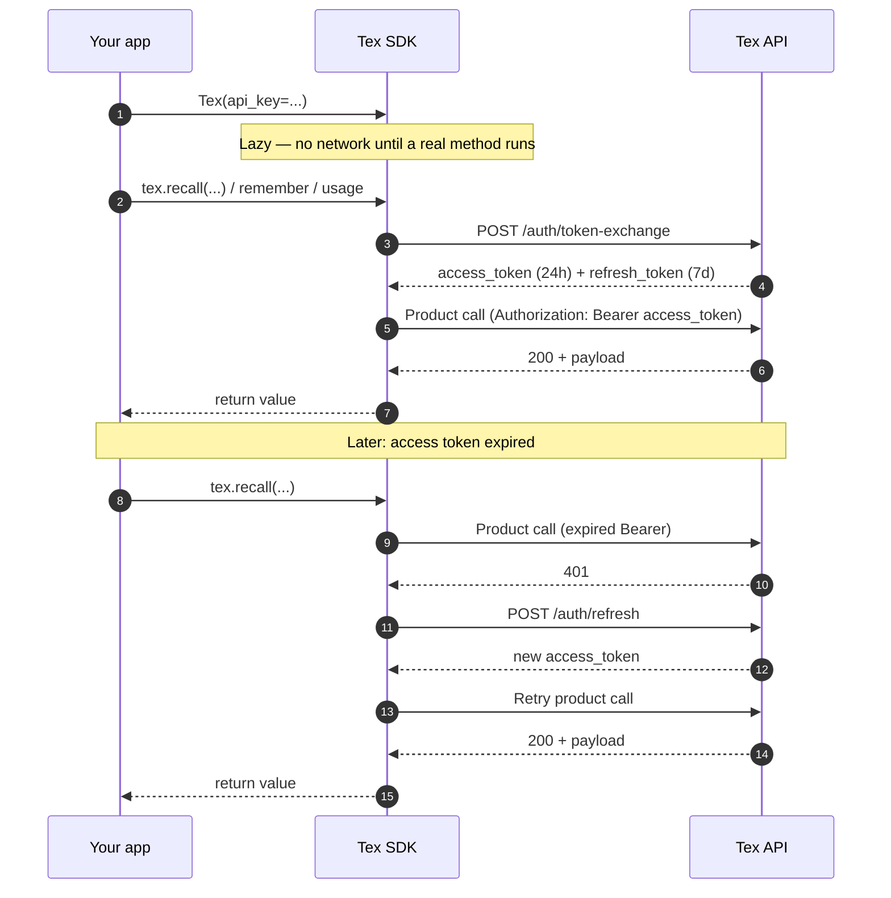

import { AuthSequence } from "/snippets/flow-visuals.mdx";

<Info>
  If you only need a working client, start with the [Quickstart](/quickstart). Come back here when you are wiring secrets, using your own JWT, or rotating keys.
</Info>

The SDK starts with your API key. On the first real call, it exchanges that key for short-lived access and refresh tokens.

After that, the client keeps the tokens in memory, refreshes them when needed, and retries the original call. Most apps never need to handle raw token strings.

## Flow

The diagram shows what happens when your app calls the SDK.



### Steps in the SDK

<AuthSequence
  phases={[
    {
      id: "construct",
      title: "You build the client",
      detail: "Tex(api_key=...) does not call the network until you run a real method.",
    },
    {
      id: "first",
      title: "You call recall/remember/usage",
      detail: "The SDK calls POST /auth/token-exchange and receives access (24h) and refresh (7d) JWTs.",
    },
    {
      id: "steady",
      title: "SDK attaches Bearer access token",
      detail: "Your call runs with Authorization: Bearer <access_token>.",
    },
    {
      id: "refresh",
      title: "When access expires",
      detail: "The SDK calls POST /auth/refresh, gets a new access token, and retries once.",
    },
  ]}
/>

## Auth mode

Most apps use an API key. Use one of the other modes only when you already manage auth somewhere else.

<Tabs>
  <Tab title="API key (recommended)">
    ```python
    tex = Tex(
        api_key="tex_live_…",
        base_url="https://api.getmetacognition.com",
    )
    ```
    This is the default for most apps. The SDK handles token exchange and refresh.
  </Tab>
  <Tab title="Bring your own JWT">
    ```python
    tex = Tex(
        access_token=jwt_from_my_auth_service,
        refresh_token=refresh_jwt,           # optional
        org_id="org_abc",                    # required with BYO-JWT
        user_id="u_xyz",                     # required with BYO-JWT
        base_url="https://api.getmetacognition.com",
    )
    ```

    Use this when another service already creates the JWTs.

    <Warning>
      BYO-JWT does **not** auto-fill `org_id` / `user_id` from `/auth/verify`. Pass them explicitly. Every `remember` and `recall` needs them in the request scope.
    </Warning>
  </Tab>
  <Tab title="Org + user login (debug only)">
    ```python
    tex = Tex(
        org_id="org_abc",
        user_id="u_xyz",
        base_url="http://localhost:8000",
    )
    ```

    <Warning>
      `/auth/login` is **disabled** in production. It returns 403 unless the integration backend runs with `DEBUG=true`. Use this only for local development against a self-hosted backend. In production, use an API key.
    </Warning>
  </Tab>
</Tabs>

## Key storage

<CardGroup cols={2}>
  <Card title="Local dev" icon="laptop">
    `.env` file. Add it to `.gitignore`. Load with `python-dotenv`.
  </Card>
  <Card title="Docker / Kubernetes" icon="boxes-stacked">
    Secret manager mounted as `TEX_API_KEY` env var.
  </Card>
  <Card title="Vercel / Netlify" icon="cloud">
    Project environment variable named `TEX_API_KEY`.
  </Card>
  <Card title="GitHub Actions" icon="github">
    Repository secret exposed as `${{ secrets.TEX_API_KEY }}`.
  </Card>
</CardGroup>

The SDK reads `TEX_API_KEY` from the environment automatically when `api_key=` is omitted.

## Rotation

<Steps>
  <Step title="Mint key B">
    [Dashboard → API Keys → New key](https://app.getmetacognition.com/dashboard/keys).
  </Step>
  <Step title="Roll out">
    Deploy with `TEX_API_KEY=<key B>`.
  </Step>
  <Step title="Verify">
    Check the dashboard's `last_used_at` value or your own logs.
  </Step>
  <Step title="Revoke key A">
    Click **Revoke** on the old key. JWTs created from key A can keep working for up to 24h, so customers do not see a sudden failure.
  </Step>
</Steps>

## Bad key

<CodeGroup>
```python Python
from tex import Tex, AuthenticationError

try:
    tex = Tex(api_key="tex_live_BOGUS", base_url="https://api.getmetacognition.com")
    tex.usage.today()
except AuthenticationError as e:
    print(e.status_code)   # 401
    print(e.message)       # "Invalid API key" or similar
    print(e.request_id)    # Quote this when filing tickets
```

```bash cURL
$ curl -X POST https://api.getmetacognition.com/auth/token-exchange \
    -H 'content-type: application/json' \
    -d '{"api_key": "tex_live_BOGUS"}'

{"error":"HTTP 401","message":"Invalid API key","request_id":"…"}
```
</CodeGroup>

<Note>
  **Token lifetimes.** Access JWTs last 24h. Refresh JWTs last 7d. After that, the SDK exchanges your API key again. To invalidate tokens, revoke the API key they came from.
</Note>

<Card title="Next: multi-user memory" icon="layer-group" href="/concepts/scopes" horizontal>
  How `org_id` / `user_id` / `session_id` partition memory.
</Card>
