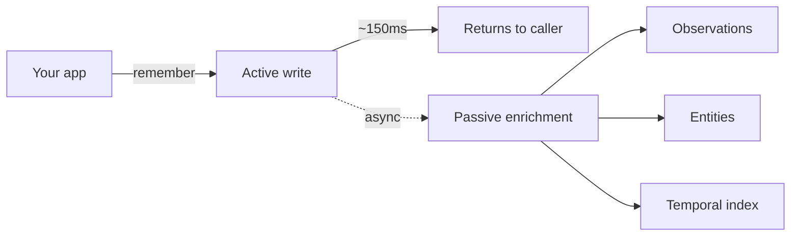

Tex stores memory in **three layers**, each with different latency and recall characteristics.

<CardGroup cols={3}>
  <Card title="Turns" icon="comments">
    The raw transcript. What was said, by whom, when.
  </Card>
  <Card title="Observations" icon="lightbulb">
    Atomic facts extracted from turns. "User avoids shellfish."
  </Card>
  <Card title="Entities" icon="diagram-project">
    Things that recur — people, places, projects — linked across observations.
  </Card>
</CardGroup>

## The write path

When you call `tex.conversations.remember(...)`, two phases run:



<Steps>
  <Step title="Active write — synchronous">
    Turns are persisted into active memory and become recallable immediately. Latency: 100–250ms. The response gives you `active_fragment_ids`.
  </Step>
  <Step title="Passive enrichment — asynchronous">
    Observations are extracted, entities are resolved against the existing graph, embeddings are generated. Takes seconds to minutes. You'll see these surface in subsequent recalls.
  </Step>
</Steps>

<Tip>
  **The turn is recallable before passive enrichment finishes.** You don't have to wait. The richer observation/entity hits will simply appear in later recalls.
</Tip>

## The read path

`tex.recall(q="...")` does a multi-stage retrieval:

<Steps>
  <Step title="Query expansion">
    Your query is rewritten into 2–3 alternate forms to broaden vector recall.
  </Step>
  <Step title="Hybrid retrieval">
    Vector search across turns + observations + entities, fused with temporal scoring.
  </Step>
  <Step title="Cross-encoder rerank">
    Top ~50 candidates are reranked by a fine-tuned cross-encoder for precision.
  </Step>
  <Step title="Confidence calibration">
    The final score is calibrated against a held-out distribution and returned as `RecallResponse.confidence` ∈ [0, 1].
  </Step>
</Steps>

## What gets stored

When you write a single turn, Tex extracts roughly:

```python
turn = {
    "role": "user",
    "text": "I just moved from Seattle to Austin for a new job at Acme.",
    "timestamp": "2026-04-15T10:30:00Z",
}
```

| Layer | What's extracted |
| --- | --- |
| Turn | The full text, role, timestamp, and a stable hash for deduping. |
| Observations | `{type: 'fact', predicate: 'lives_in', value: 'Austin'}`<br/>`{type: 'fact', predicate: 'previously_lived_in', value: 'Seattle'}`<br/>`{type: 'fact', predicate: 'works_at', value: 'Acme'}` |
| Entities | `Person(self)`, `Place(Seattle)`, `Place(Austin)`, `Org(Acme)` — linked. |
| Temporal | A point on the user's timeline, indexed for "what happened in April?" queries. |

You don't need to think about extraction — it happens automatically. But you *can* pre-extract on your side and pass observations inline if you want determinism. See [`conversations.remember`](/sdk/conversations-remember).

## Active vs deep recall

<Tabs>
  <Tab title="Active mode (default)">
    ```python
    hits = tex.recall(q="...", session_id=sid)  # mode="active"
    ```
    Single-pass retrieval. Latency 1.5–2.5s. Use this for every interactive call.
  </Tab>
  <Tab title="Deep mode">
    ```python
    hits = tex.recall(q="...", session_id=sid, mode="deep")
    ```
    Two-pass with iterative reranking. Latency 3–6s. Higher recall on older or less-obvious memory. Use when active confidence is < 0.4 or for periodic analysis tasks.
  </Tab>
</Tabs>

## Confidence

Every recall returns a `confidence ∈ [0, 1]`. Calibration target: P(any hit is relevant | confidence = c) ≈ c.

| Range | Meaning | Suggested action |
| --- | --- | --- |
| ≥ 0.6 | Strong | Use hits as-is |
| 0.3 – 0.6 | Useful but uncertain | Use, but cite sources to the user |
| < 0.3 | Weak | Try `mode="deep"`, or generate without memory |

```python
hits = tex.recall(q=q, session_id=sid)
if hits.confidence < 0.3:
    hits = tex.recall(q=q, session_id=sid, mode="deep")
```

<Card title="Next: scopes" icon="layer-group" href="/concepts/scopes">
  How org / user / session partition memory.
</Card>
