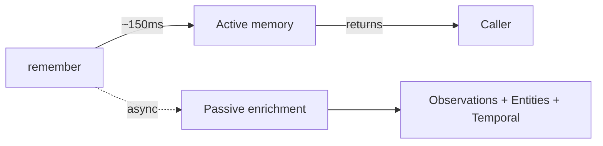
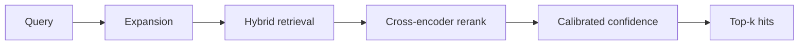

Tex stores memory in three layers, each with different latency and recall characteristics.

<CardGroup cols={3}>
  <Card title="Turns" icon="comments">
    The raw transcript. What was said, by whom, when.
  </Card>
  <Card title="Observations" icon="lightbulb">
    Atomic facts extracted from turns. *"User avoids shellfish."*
  </Card>
  <Card title="Entities" icon="diagram-project">
    Recurring things — people, places, projects — linked across observations.
  </Card>
</CardGroup>

## How writes work



- **Active write** is synchronous. Turns are recallable in ~150ms.
- **Passive enrichment** runs in the background. Observations and entities surface in subsequent recalls.

You don't wait for enrichment. The active turn is enough for the next request.

## How reads work



Vector search + temporal scoring + entity-graph hits, fused, reranked, then calibrated. The output: scored turns, observations, and entities — plus a confidence number.

## What gets extracted

Take this turn:

```python
{"role": "user", "text": "I just moved from Seattle to Austin for a job at Acme.", "timestamp": "..."}
```

| Layer | What's stored |
| --- | --- |
| Turn | Full text, role, timestamp, dedup hash |
| Observations | `lives_in: Austin`, `previously_lived_in: Seattle`, `works_at: Acme` |
| Entities | `Person(self)`, `Place(Seattle)`, `Place(Austin)`, `Org(Acme)` — linked |
| Temporal | A point on the user's timeline |

You don't think about extraction — it's automatic. You *can* pre-extract and pass observations inline. See [`conversations.remember`](/sdk/conversations-remember).

<Card title="Next: multi-user memory" icon="layer-group" href="/concepts/scopes" horizontal>
  Org / user / session partitioning.
</Card>
