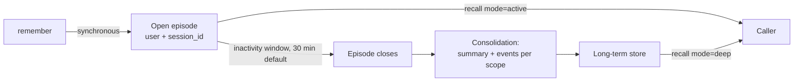
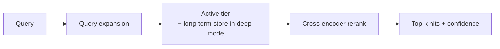

Tex keeps memory in two tiers and moves conversations from the first to the second automatically.

<CardGroup cols={2}>
  <Card title="Active tier" icon="bolt">
    Recent conversation turns, organised into open **episodes**. Written synchronously, recallable right away. Searched by `recall(mode="active")`.
  </Card>
  <Card title="Long-term store" icon="database">
    Consolidated episodes, documents, and the knowledge graph extracted from them. Searched by `recall(mode="deep")` and the Supermemory-compatible search APIs.
  </Card>
</CardGroup>

## What you write

| You call | What is stored |
| --- | --- |
| [`conversations.remember`](/sdk/conversations-remember) | Turns (`role`, `text`, `timestamp`) plus any `observations` you pass, in the active tier and the long-term store |
| [`documents.add`](/sdk/documents) | A document, processed asynchronously by the ingestion pipeline (extraction, chunking, indexing) into the long-term store |
| [`memories.add`](/sdk/memories) | Short memory items, written to the long-term store and the active tier |

Every write is stamped with a [scope](/concepts/scopes) — your personal `user:<id>` scope by default, or a team, project, or org scope you are a member of.

## Episodes and consolidation



- An **episode** is one user's `session_id`. Turns written with the same `session_id` land in the same episode.
- An episode **closes after its inactivity window passes without writes** — 30 minutes by default. You can set the window per write (`inactivity_timeout_seconds`, 5 minutes to 24 hours) or as an org default. See [Inactivity window](#inactivity-window).
- On close, Tex **consolidates** the episode: it builds a summary and event records for each scope in the episode and ingests them into the long-term store. After a successful ingest, the episode's text is removed from the active tier.
- A later write with the same `session_id` starts a new episode. Nothing is lost.

<Tip>
  Once a session has been idle past its window (30 minutes by default) and consolidated, its turns are found by `recall(mode="deep")`, not `mode="active"`.
</Tip>

## Inactivity window

The inactivity window is how long an episode can sit idle before it closes and consolidates. It is resolved for each write:

1. The write's own value — `inactivity_timeout_seconds` on `/ingestion/memory` (`inactivityTimeoutSeconds` on `/v4/memories`)
2. The SDK client's `active_inactivity_timeout_seconds` (SDK 1.2.1+)
3. Your org default, set by an org admin with [`PATCH /me/settings`](/api-reference/account/settings)
4. 30 minutes

Allowed range: **300 – 86,400 seconds** (5 minutes to 24 hours). Values outside it return `422` (`400` on `/v4/memories`); SDK 1.2.1+ raises `InvalidInactivityTimeoutError` before sending.

The episode stores the last window it was given. A later write that sends no window keeps it — but if your org has a default, writes without their own value carry the org default, which replaces the stored window. To hold a custom window for a whole conversation in an org with a default, pass it on every write.

```python
# SDK 1.2.1+: long analysis sessions stay in the active tier for 2 hours of idle time
tex.conversations.remember(turns, session_id="fy27-model-review",
                           inactivity_timeout_seconds=7200)
```

| Longer window | Shorter window |
| --- | --- |
| Turns stay in the fast active tier longer, so `mode="active"` keeps finding them | Conversations reach long-term memory and the knowledge graph sooner |
| Consolidation into long-term memory happens later | `mode="active"` stops finding them sooner — use `deep` |
| Good for long, interrupted working sessions | Good for short exchanges and quick lookups |

## Observations

Observations are short facts attached to a turn. Tex stores the ones you pass — it does not extract observations from turns on the `remember` path:

```python
{"role": "user", "text": "I just moved from Seattle to Austin for a job at Acme.",
 "timestamp": "2026-09-14T10:00:00Z",
 "observations": ["lives in Austin", "previously lived in Seattle", "works at Acme"]}
```

Observations are returned in `hits.observations` and get a small ranking boost.

## How reads work



`recall` searches every scope you can see, reranks, and returns scored turns and observations plus a `confidence` score. See [Recall and ranking](/concepts/retrieval).

<Card title="Next: users, teams, and scopes" icon="layer-group" href="/concepts/scopes" horizontal>
  Personal, team, project, and org memory.
</Card>
