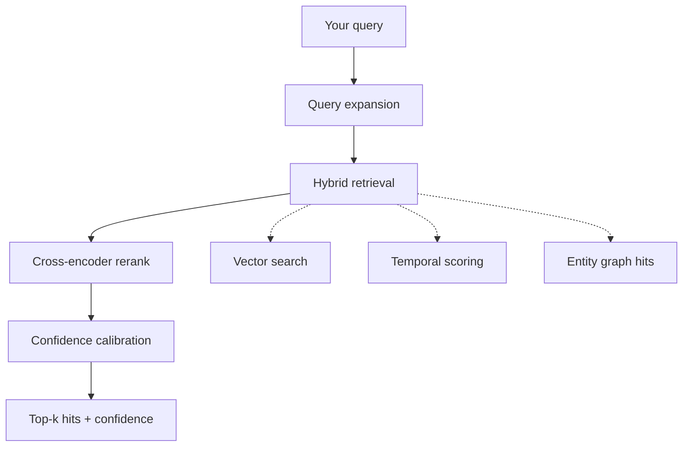

`tex.recall(q="...")` is your read path. This page is what to know to get good results.

## The pipeline



| Stage | What happens | Why |
| --- | --- | --- |
| Query expansion | Your query is rewritten into 2–3 alternates | Catches paraphrases the embedding alone misses. |
| Hybrid retrieval | Vector search + temporal + entity-graph hits, fused | Each modality has different failure modes. |
| Rerank | Top ~50 candidates → cross-encoder | Precision over recall at the top. |
| Calibration | Score → calibrated confidence | So `confidence = 0.7` actually means "70% chance these are relevant". |

## `mode="active"` vs `mode="deep"`

<Tabs>
  <Tab title="active (default)">
    Single-pass. **Latency: 1.5–2.5s.**

    Use for: every interactive call. Real-time chat. Agent loops. Anything user-facing.

    ```python
    hits = tex.recall(q=user_msg, session_id=sid, top_k=5)
    ```
  </Tab>
  <Tab title="deep">
    Two-pass with iterative reranking. **Latency: 3–6s.**

    Use for:
    - "What do you remember about X?" (explicit user request)
    - Periodic analysis tasks (weekly digests, summaries)
    - Active mode returned `confidence < 0.4`

    ```python
    hits = tex.recall(q=user_msg, session_id=sid, mode="deep", top_k=10)
    ```
  </Tab>
</Tabs>

## Tuning `top_k`

Defaults to 8. Sensible ranges:

| Use case | `top_k` |
| --- | --- |
| Live chat — small context window | 3–5 |
| Live chat — large context window | 5–10 |
| Summaries / digests | 15–30 |
| "Tell me everything about X" | 30–50 |

Larger `top_k` → more `tokens_out` billed. Cap at 8 unless you have a reason.

## Confidence-gated fallback

```python
hits = tex.recall(q=q, session_id=sid)

if hits.confidence < 0.3:
    # Try deep mode before giving up
    hits = tex.recall(q=q, session_id=sid, mode="deep")

if hits.confidence < 0.2:
    # Still nothing — generate without memory
    return llm.complete(prompt_without_memory)

context = "\n".join(f"- {h.text}" for h in hits.hits.turns)
return llm.complete(prompt_with(context))
```

## What's in a hit

```python
@dataclass
class RecallHit:
    id: str             # stable identifier; persists across recalls
    text: str           # the matched content
    score: float        # raw relevance, 0.0–1.0
    kind: str           # "turn" | "observation" | "entity"
    timestamp: str | None
```

`RecallResponse.hits` exposes three lists:

```python
hits.hits.turns         # list[RecallHit]
hits.hits.observations  # list[RecallHit]
hits.hits.entities      # list[RecallEntity]   (with relationships)
```

For chatbot prompting, `turns` is usually enough. For analytical queries (e.g. "list all preferences"), prefer `observations`.

## Including the timeline

```python
hits = tex.recall(q="when did we discuss pricing?", session_id=sid, include_timeline=True)
for event in hits.timeline:
    print(event["timestamp"], event["summary"])
```

Returns a chronologically-ordered list of relevant events. Useful for "when did the user first mention X?" and similar temporal queries.

<Card title="Next: usage & billing" icon="receipt" href="/concepts/usage-billing">
  Tokens in / out, daily quotas, and cost control.
</Card>
