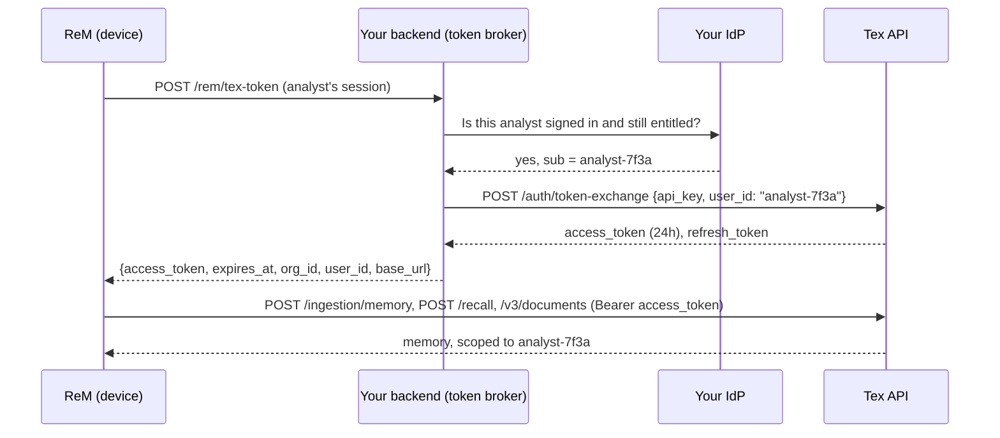
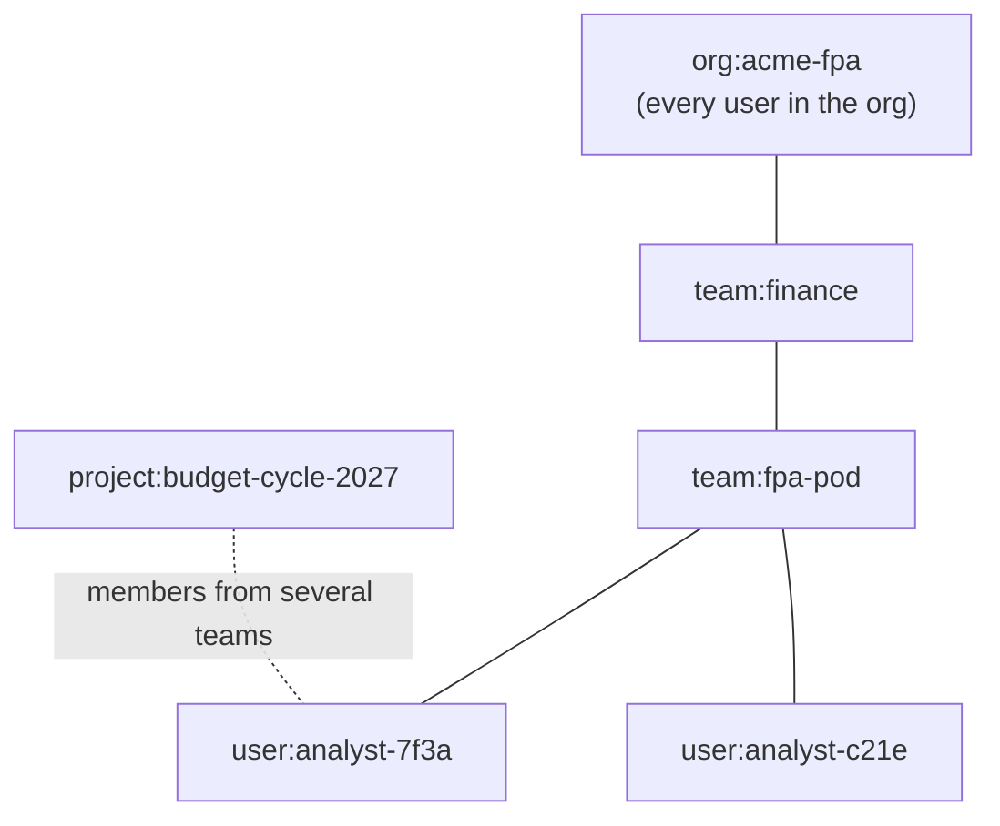
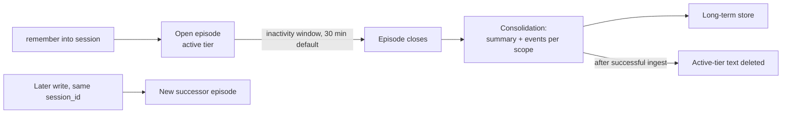

# ReM integration guide

_Connect ReM, an on-device context layer for FP&A teams, to Tex with per-user tokens and hierarchical scopes._

> Standalone copy of the Tex docs page `integrations/rem.mdx`. Matches tex-sdk 1.3.1 and https://api.getmetacognition.com.

ReM runs on the analyst's device. It captures working context (notes, model reviews, variance commentary), surfaces it back in the UI, and shares the right slices with the right people: the analyst alone, the FP&A pod, the whole finance team, or everyone on one budget cycle.

Tex holds the memory. ReM never holds a Tex API key. Your backend holds the key and gives each signed-in analyst a short-lived token that works only for them.

- **[Architecture](#architecture)**: Device, token broker, Tex, and why the key stays on your server.
- **[Scope model](#scope-model)**: Scopes for the org, teams, budget-cycle projects, and analysts.
- **[On-device flows](#on-device-flows)**: Capture, fast recall, deep recall, documents, offline queue.
- **[End-to-end example](#end-to-end-example)**: Python broker, Python device client, raw HTTP for any language.

> **Note:**
> Everything on this page matches **tex-sdk 1.3.1** (`pip install tex-sdk==1.3.1`) and the production API at `https://api.getmetacognition.com`. Managing memberships with `tex.scopes` and offboarding with `tex.deletions` need 1.3.0 or later; on older versions, call the same `/me/*` routes over raw HTTP. The inactivity-window arguments need 1.2.1 or later.

## Architecture



Three parties, three jobs:

| Party | Holds | Does |
| --- | --- | --- |
| ReM (device) | The analyst's current Tex access token | Captures context, recalls it, uploads documents |
| Your backend (token broker) | The Tex API key (with the `impersonate_user` scope) | Authenticates the analyst with your IdP, exchanges the key for a per-user token |
| Tex | The memory | Enforces identity and scope on every call |

### Keep the API key on the server

> **Warning:**
> An API key with the `impersonate_user` scope can mint a token for **any user in your org**. Never ship it in a device app, config file, or mobile bundle. Anyone who pulls it out of the binary can read every analyst's memory.

Mint the broker key with scopes exactly `["impersonate_user"]`. Nothing else:

- Per-user tokens **inherit the key's roles**. Every extra scope on the broker key widens what every analyst token can do.
- `*`, `agent`, `service`, `system`, and `tenant:write:any_user` also allow impersonation, but they grant more than a broker needs.
- A key without an impersonation scope gets `403 user_id override not permitted` from `/auth/token-exchange`.

### The `act` claim: per-user tokens can't impersonate

A token minted with a `user_id` carries these claims:

```json
{
  "org_id": "acme-fpa",
  "user_id": "analyst-7f3a",
  "roles": ["impersonate_user"],
  "act": { "sub": "apikey_3b9c8d21" },
  "exp": 1789488000,
  "type": "access"
}
```

`act` records that the broker key minted the token **for** this analyst. Tex treats a token with `act` as bound to a single user:

- It can't act as anyone else. A `containerTag` naming another user on `/v3` or `/v4` returns `403 container_tag_not_permitted`.
- It can't mint, list, or revoke API keys.
- It can't request a `user_id` override anywhere.

So a stolen device token exposes one analyst's view — their personal memory and the scopes they belong to — not the whole org, and only until it expires.

### Token lifetime, refresh, and revocation

| Fact | Value |
| --- | --- |
| Access token lifetime | 24 hours (`expires_in: 86400`) |
| Refresh token lifetime | 7 days by default |
| Per-token revocation endpoint | None today |
| Revoking the API key | Stops new exchanges, and `/auth/refresh` returns `401` for tokens minted from it. Access tokens already issued stay valid until they expire. |
| `POST /auth/refresh` | Checks that the issuing API key is still active. It can't know whether the analyst is still employed. |

Because refresh can't re-check the analyst's entitlement, use this pattern:

**1. Send only the access token to the device**

The broker drops the `refresh_token`. The device never sees it.

**2. Re-check entitlement on every mint**

When the device asks for a token, the broker checks your IdP first: the analyst is signed in, active, and allowed to use ReM. Then it calls `/auth/token-exchange`.

**3. Cache per user, refresh early**

Cache tokens per `user_id` and mint a new one some time before `expires_at`, for example 15 minutes early.

**4. Offboard by refusing to mint**

Disable the analyst in your IdP and evict their cached token. The worst-case exposure is whatever life their last access token has left, up to 24 hours.

## Scope model

Tex scopes are ids of the form `<kind>:<value>`, where `kind` is `user`, `team`, `org`, or `project`. Here's a typical FP&A layout:



| Scope | Who sees it | Use it for |
| --- | --- | --- |
| `org:acme-fpa` | **Every user in the Tex org**, implicitly | Org-wide policy, the planning calendar, chart-of-accounts conventions. Never analyst-private or deal-sensitive data. |
| `team:finance` | Granted members | Finance-wide context: close timelines, reporting standards |
| `team:fpa-pod` | Granted members | The pod's working sessions and model reviews |
| `project:budget-cycle-2027` | Granted members, across teams | Budget-cycle decisions, assumptions, variance memos |
| `user:analyst-7f3a` | That analyst only, implicitly | Personal scratch notes. This is the default for every write. |

> **Note:**
> The org scope's value is your **Tex org id**. For org `acme-fpa`, the org scope is `org:acme-fpa`. `org:` and `user:` scopes are implicit, so they can't be granted: only `team:` and `project:` memberships exist.

### Visible scopes

An analyst's visible scopes are the union of:

- `user:<their user_id>` (implicit)
- `org:<the org id>` (implicit)
- every membership granted to them

Every read and write is checked against that set.

### How writes pick a scope

A write lands in the first of these that's set:

1. The `scope=` argument on the call
2. `default_scope` on the `Tex` client
3. The analyst's personal scope, `user:<user_id>`

Give each ReM surface its own default and override per write when needed:

| ReM surface | Client `default_scope` | Per-write override |
| --- | --- | --- |
| Personal notebook | none (personal) | none |
| Pod workspace | `"team:fpa-pod"` | `scope="user:<id>"` for a private aside |
| Budget-cycle room | `"project:budget-cycle-2027"` | none |

A write into a scope the analyst can't see fails with `403`:

```json
{
  "error": "HTTP 403",
  "message": "Write scope 'project:budget-cycle-2027' is not in your visible scopes. ...",
  "details": {
    "error": "scope_not_visible",
    "scope": "project:budget-cycle-2027",
    "message": "...",
    "visible_scopes": ["org:acme-fpa", "team:fpa-pod", "user:analyst-7f3a"]
  }
}
```

A malformed id such as `"budget-2027"` never reaches the server. The SDK raises `InvalidScopeError`, a `ValueError`.

### How reads span scopes

- **No scope:** recall searches **every** visible scope.
- **`scope="team:fpa-pod"`:** recall narrows to that one scope. If the analyst can't see it, the call fails with `403 scope_not_visible`.
- **`default_scope`:** applies to writes only. It never narrows reads.

### Managing memberships

Your team manages memberships itself, from the **owner key on the ReM server** — the org admin key (`["*"]`) created at signup, on a client built without `user_id=`. Use `tex.scopes` in the SDK, or `/me/scope-memberships` over HTTP. See the Tex docs page `sdk/scopes` (Managing memberships).

- **Never use the broker key or a device token.** Both get `403`: the broker key (`["impersonate_user"]`) isn't an org admin, and a per-user token is always refused, so an analyst can never grant themselves a scope.
- **Only `team:` and `project:` scopes can be granted.** `user:` and `org:` scopes are implicit; granting one raises `ScopeNotDelegableError` in the SDK (`403` over HTTP).
- **You can grant before first sign-in.** A grant for an analyst who hasn't used ReM yet takes effect with their first token.
- **Changes take effect on the analyst's next token refresh.** Allow up to 1 hour.

`Python (owner key, ReM server)`

```python
import os
from tex import Tex

owner = Tex(api_key=os.environ["TEX_OWNER_API_KEY"],   # the ["*"] key — never the broker key
            base_url="https://api.getmetacognition.com")

grant = owner.scopes.grant("analyst-7f3a", "project:budget-cycle-2027")   # role="member"
print(grant.created)   # False on a replay; a different role updates the stored role

owner.scopes.list(user_id="analyst-7f3a")      # implicit user:/org: scopes are not listed
owner.scopes.revoke("analyst-7f3a", "project:budget-cycle-2027")   # NotFoundError if absent
```

`Grant (HTTP)`

```bash
curl -X POST https://api.getmetacognition.com/me/scope-memberships \
  -H "Authorization: Bearer $TEX_OWNER_JWT" \
  -H 'content-type: application/json' \
  -d '{"user_id":"analyst-7f3a","scope_id":"project:budget-cycle-2027","role":"member"}'
# 201 {"membership": {...}, "created": true, "note": "..."}
# Replaying the same grant returns 200 with "created": false. A different role updates the stored role.
```

`List (HTTP)`

```bash
curl -H "Authorization: Bearer $TEX_OWNER_JWT" \
  "https://api.getmetacognition.com/me/scope-memberships?user_id=analyst-7f3a"
# {"memberships": [...], "total": 1}   (implicit user:/org: scopes are not rows)
```

`Revoke (HTTP)`

```bash
curl -X DELETE https://api.getmetacognition.com/me/scope-memberships \
  -H "Authorization: Bearer $TEX_OWNER_JWT" \
  -H 'content-type: application/json' \
  -d '{"user_id":"analyst-7f3a","scope_id":"project:budget-cycle-2027"}'
# 204 No Content   404 if no such grant
```

`$TEX_OWNER_JWT` is an access token from `POST /auth/token-exchange` with the owner key and **no** `user_id`.

### New members and removals

- **New member.** Once propagated, the analyst sees everything already in the scope, including memory written before they joined. Data belongs to the scope, not to whoever wrote it. The documented guarantee is that a change takes effect on the analyst's next token refresh; allow up to 1 hour.
- **Removed member.** Once propagated, reads narrowed to that scope and writes into it return `403`. Unscoped recall stops returning that scope's memory. Data already written stays in the scope, visible to remaining members. The analyst's personal `user:` memory isn't affected. To remove data as well, see [Offboarding an analyst](#offboarding-an-analyst).

## On-device flows

### Capture context

Send turns with `conversations.remember`. Every turn needs:

| Field | Rule |
| --- | --- |
| `role` | `"user"` or `"assistant"` only. `"system"` returns `422`. |
| `text` | Non-empty string |
| `timestamp` | ISO-8601 string. **Required.** A missing timestamp returns `422`. |
| `observations` | Optional list of **strings**: facts you extracted yourself |

Use one `session_id` per work session or per document, for example `fy27-emea-opex-review-20260914`. Keep it short and limited to `[A-Za-z0-9._-]`.

> **Warning:**
> `session_id` **groups** turns into an episode. It doesn't **isolate** them. Recall searches every visible scope, whatever `session_id` you pass. Isolation comes from the per-user token and from scopes.

### Fast recall vs deep recall

| | `mode="active"` (default) | `mode="deep"` |
| --- | --- | --- |
| Searches | The active tier: open episodes the analyst can see | The active tier **plus** the long-term store (consolidated episodes, documents, graph), with a second query pass |
| Speed | The fast path | Slower, broader |
| Use in ReM for | Inline suggestions, "what was I just doing", side-panel lookups while the analyst works | "What did we decide about EMEA travel last quarter?", anything older than the current session, document questions |

Inside a project view, narrow with `scope="project:budget-cycle-2027"`. On a global search box, leave `scope` unset.

Some fields need care:

- **`confidence`** is a sigmoid of the top reranker score. It's a relative signal, not a calibrated probability. Tune thresholds on your own data.
- **`hits.entities`** is always empty today.
- **`active_tier_error`.** If the active tier fails, results come from the remaining tier and `resp.active_tier_error` explains why. Show a degraded state rather than "no memory".
- **`top_k`** defaults to 15 in active mode and 25 in deep mode. The server caps it at 30.

### Active memory lifecycle



- An episode is one analyst plus one `session_id`.
- It closes after its **inactivity window** passes without writes: **30 minutes by default**, configurable from 5 minutes to 24 hours.
- On close, consolidation summarizes the episode's fragments separately for each scope and ingests the summary and events into the long-term store. Once that ingest succeeds, the episode's active-tier text and vectors are deleted.
- A later write with the same `session_id` goes into a new successor episode. Nothing is lost.

### Choose an inactivity window per surface

The window is resolved for each write, first match wins:

1. The write's own value: `inactivity_timeout_seconds` on `POST /ingestion/memory` (`inactivityTimeoutSeconds` on `/v4/memories`), or the same argument on `conversations.remember` / `memories.add` / `memories.update_memory` in **tex-sdk 1.2.1+**
2. The SDK client default: `Tex(..., active_inactivity_timeout_seconds=...)` (tex-sdk 1.2.1+)
3. The org default, set with `PATCH /me/settings` `{"active_memory_inactivity_seconds": 3600}` (`null` resets)
4. 30 minutes

Allowed range is 300–86,400 seconds. Out of range returns `422` (`400` on `/v4/memories`); tex-sdk 1.2.1+ raises `InvalidInactivityTimeoutError` before sending. tex-sdk 1.2.0 has no argument for it: send the field over raw HTTP, or upgrade.

The episode stores the last window it was given, and later writes that omit it keep it. One exception: if your org has a default, writes without their own value carry the org default, which replaces the stored window. When a surface uses a custom window in an org with a default, pass it on every write, which a client-level `active_inactivity_timeout_seconds` does for you.

| ReM surface | Suggested window | Why |
| --- | --- | --- |
| Long analysis sessions (model reviews, variance deep-dives, budget build) | 1–4 hours (`3600`–`14400`) | Analysts step away for meetings. The session stays in the fast active tier through the break. |
| Quick lookups and side-panel captures | Default (30 min) | Short exchanges reach long-term memory and the knowledge graph sooner. |
| Month-end close war room | Up to 24 hours (`86400`) | One working day as one episode. |

The trade-off:

- **Longer window.** Memories stay in the fast active tier longer, so `mode="active"` keeps finding them. They reach long-term memory and the knowledge graph later, so graph-backed `deep` answers about that session arrive later.
- **Shorter window.** Consolidation happens sooner. `mode="active"` stops finding the session sooner, so use `deep` for it.

The org default is an org-admin setting. It needs a token exchanged **without** `user_id` from a key with `admin` or `*`, and per-user tokens get `403`. The broker key (`["impersonate_user"]`) can't change it. Use the owner key for that, stored server-side and used only for admin tasks such as settings, memberships, and deletions.

What this means for ReM:

- Active recall covers sessions written within their inactivity window.
- Once a session has been idle past its window and consolidated, only `mode="deep"` finds it.
- If an analyst reopens yesterday's review, recall with `mode="deep"` to pull the history, then keep writing to the same `session_id`.

### Documents

Upload variance memos, board decks as text, or assumption sheets with `documents.add`, then poll `documents.get`:

| `status` | Meaning |
| --- | --- |
| `queued` | Accepted, waiting for the pipeline |
| `extracting` | Parsing and extraction |
| `chunking` | Splitting into chunks |
| `indexing` | Writing to the long-term store |
| `done` | Searchable (use `mode="deep"`) |
| `failed` | Failed after the pipeline's automatic retries of transient errors. See `metadata["ingestionError"]`; re-add the document to try again |

Processing runs the full ingestion pipeline and can take minutes. Poll with backoff.

- **Missing or not visible.** `documents.get` returns `404 NotFoundError` whether the id doesn't exist or belongs to a scope the analyst can't see. The two cases can't be told apart.
- **Updates and deletes.** A document id starting with `doc-` can't be updated or deleted: `documents.update` and `documents.delete` return `409 ConflictError`. Add a new version instead.
- **Listing.** `documents.list` lists graph nodes, not these pipeline documents. Track your own document ids.
- **containerTag.** With a per-user token, omit `container_tag` or set it to the analyst's own `user_id`.

### Offline queue and retries

Analysts work on planes and behind VPNs. Queue writes locally and flush when online.

| Call | Idempotent? | Retry rule |
| --- | --- | --- |
| `conversations.remember` | **Partly.** The active-tier fragment id is derived from write scope, org, user, session, timestamp, and text, so replaying an identical turn doesn't duplicate it. The long-term write and token metering are **not** deduplicated. | Stamp `timestamp` once, at capture. Store it with the queued turn and never regenerate it on replay. Delete a queue item as soon as its call succeeds. |
| `documents.add` | **No.** Every call creates a new `doc-…` id. | Save the returned id right away. After a timeout, check before resending; don't blind-retry. |
| `memories.add` | **No.** New ids every call. | Same as `documents.add` |
| `recall`, `documents.get` | Reads | Safe to retry |

- **SDK retries.** By default the SDK retries `408`, `429`, `5xx`, and network errors twice, with 0.5 s then 1 s backoff. For queue flushing, set `max_retries=0` and let your queue own the retry policy.
- **Don't retry client errors.** Never retry `400`, `401`, `403`, `404`, `409`, or `422` unchanged. For `401`, get a new token first.
- **Quota.** A `429` with `quota_exceeded` won't clear until 00:00 UTC.

### Limits you can rely on

| Limit | Value |
| --- | --- |
| Daily input tokens, per org | 1,000,000 (UTC day). Over the limit: `429`, `details.kind = "tokens_in_daily"` |
| Daily output tokens, per org | 5,000,000 (UTC day). Over the limit: `429`, `details.kind = "tokens_out_daily"` |
| Request body | 50 MB at the edge |
| `top_k` | 1–50 accepted, capped at 30 |
| `user_id`, `session_id` in token exchange | 1–256 characters |
| `containerTag` | ≤ 100 characters, `^[a-zA-Z0-9_-]+$` |
| Per-minute rate limit | None enforced by the API today. Only the daily token quota applies. |

### Financial data and PII

- **Where data lives.** Everything ReM sends is stored server-side in Tex: turns, documents, episode summaries, and embeddings, in the active tier and the long-term store. Nothing is kept only on the device.
- **Scope is your sharing control.** Pick it deliberately for every surface.
- **Keep sensitive data out of `org:`.** Every user in the org can read `org:acme-fpa`. Never write deal-sensitive numbers, compensation, or personal notes there.
- **Minimize PII.** Leave out personal data the analyst's workflow doesn't need, such as employee names in headcount plans or personal contact details.
- **No secrets in metadata.** Don't put credentials, account numbers, or tokens in `metadata`.
- **Use `project:` for restricted work.** For material that only certain people should see, such as an M&A scenario, create a dedicated `project:` scope and grant it narrowly. Don't use a broad team scope.

## End-to-end example

### 1. Token broker (Python, your server)

`broker.py`

```python
import os
import threading
import time

import httpx
from fastapi import Depends, FastAPI, HTTPException, Request

TEX_BASE_URL = os.environ.get("TEX_BASE_URL", "https://api.getmetacognition.com")
TEX_API_KEY = os.environ["TEX_BROKER_API_KEY"]  # scopes: ["impersonate_user"]; server-side only
TEX_ORG_ID = os.environ["TEX_ORG_ID"]           # e.g. "acme-fpa"
REFRESH_MARGIN_S = 15 * 60

_http = httpx.Client(base_url=TEX_BASE_URL, timeout=10.0)
_cache = {}
_lock = threading.Lock()

def mint_tex_token(user_id):
    """Per-user Tex access token, cached until 15 minutes before expiry."""
    now = time.time()
    with _lock:
        cached = _cache.get(user_id)
        if cached and cached["expires_at"] - REFRESH_MARGIN_S > now:
            return cached

    resp = _http.post(
        "/auth/token-exchange",
        json={"api_key": TEX_API_KEY, "user_id": user_id},
    )
    if resp.status_code == 403:
        # "user_id override not permitted": the key lacks impersonate_user
        raise RuntimeError("Tex broker key is missing the impersonate_user scope")
    resp.raise_for_status()
    body = resp.json()

    token = {
        "access_token": body["access_token"],  # refresh_token deliberately NOT forwarded
        "expires_at": int(now) + int(body["expires_in"]),
        "org_id": TEX_ORG_ID,
        "user_id": user_id,
        "base_url": TEX_BASE_URL,
    }
    with _lock:
        _cache[user_id] = token
    return token

def forget_user(user_id):
    """Call on offboarding so no cached token is handed out again."""
    with _lock:
        _cache.pop(user_id, None)

app = FastAPI()

def current_analyst(request: Request) -> str:
    """Replace with your IdP session / JWT verification.

    Return a stable, opaque user id (e.g. the IdP subject mapped to [A-Za-z0-9_-]).
    Refuse users who are disabled or not entitled to ReM.
    """
    user = getattr(request.state, "user", None)
    if not user or not user.get("rem_enabled"):
        raise HTTPException(status_code=401, detail="not signed in")
    return user["sub"]

@app.post("/rem/tex-token")
def tex_token(user_id: str = Depends(current_analyst)):
    return mint_tex_token(user_id)
```

### 2. Device client (Python)

For a Python or desktop build of ReM:

`rem_client.py`

```python
from datetime import datetime, timezone

import httpx
from tex import AuthenticationError, PermissionDeniedError, Tex

BROKER_URL = "https://fpa-backend.example.com/rem/tex-token"

def fetch_token(app_session):
    r = httpx.post(BROKER_URL, headers={"Authorization": f"Bearer {app_session}"}, timeout=10)
    r.raise_for_status()
    return r.json()

def make_client(tok, default_scope=None, inactivity_seconds=None):
    return Tex(
        access_token=tok["access_token"],
        base_url=tok["base_url"],
        org_id=tok["org_id"],    # explicit is clearer; SDK 1.2.0–1.2.1 require it for access tokens
        user_id=tok["user_id"],
        default_scope=default_scope,
        active_inactivity_timeout_seconds=inactivity_seconds,  # tex-sdk 1.2.1+
    )

def now_iso():
    return datetime.now(timezone.utc).isoformat().replace("+00:00", "Z")

def tex_error_code(e):
    """Structured error code, e.g. 'scope_not_visible' or 'container_tag_not_permitted'."""
    d = e.details if isinstance(e.details, dict) else {}
    inner = d.get("details")
    return (inner if isinstance(inner, dict) else d).get("error")

app_session = "..."  # your app's own session credential
tok = fetch_token(app_session)
# Pod workspace: long analysis sessions stay in the active tier through 2 h breaks
pod = make_client(tok, default_scope="team:fpa-pod", inactivity_seconds=7200)

# Capture: a pod working session (writes land in team:fpa-pod)
pod.conversations.remember(
    [
        {"role": "user", "text": "EMEA travel is 18% over plan in Q3; hold the forecast flat.",
         "timestamp": now_iso()},
        {"role": "assistant", "text": "Noted: EMEA travel flat for Q4 forecast pending the review.",
         "timestamp": now_iso()},
    ],
    session_id="fy27-emea-opex-review-20260914",
)

# A private aside in the same session stays personal
pod.conversations.remember(
    [{"role": "user", "text": "Double-check the FX rate used in the EMEA roll-up.", "timestamp": now_iso()}],
    session_id="fy27-emea-opex-review-20260914",
    scope="user:" + tok["user_id"],
)

# Fast recall for the side panel (all visible scopes)
hits = pod.recall("EMEA travel forecast", session_id="fy27-emea-opex-review-20260914", top_k=5)
for h in hits.hits.turns + hits.hits.observations:
    print(f"[{h.score:.2f}] {h.text}")
if hits.active_tier_error:
    print("degraded: active tier unavailable")

# Deep recall, narrowed to the budget-cycle project
try:
    history = pod.recall(
        "what did we decide about travel budgets last cycle?",
        session_id="fy27-emea-opex-review-20260914",
        mode="deep",
        scope="project:budget-cycle-2027",
    )
except PermissionDeniedError as e:
    if tex_error_code(e) == "scope_not_visible":
        print("not a member yet; visible:", e.details["details"]["visible_scopes"])
    else:
        raise
except AuthenticationError:
    # Token expired: get a new one from the broker and rebuild the client
    pod.close()
    tok = fetch_token(app_session)
    pod = make_client(tok, default_scope="team:fpa-pod", inactivity_seconds=7200)
```

Document upload and polling:

`rem_documents.py`

```python
import time

from tex import Tex

def upload_memo(tex: Tex, text: str, memo_id: str) -> str:
    doc = tex.documents.add(
        text,
        custom_id=memo_id,
        metadata={"source": "rem", "doc_type": "variance_memo"},
        scope="project:budget-cycle-2027",
    )
    return doc.id  # persist this id before doing anything else

def wait_for_document(tex: Tex, doc_id: str, timeout_s: float = 900.0):
    delay = 2.0
    deadline = time.monotonic() + timeout_s
    while time.monotonic() < deadline:
        doc = tex.documents.get(doc_id)
        if doc.status == "done":
            return doc
        if doc.status == "failed":
            raise RuntimeError((doc.metadata or {}).get("ingestionError") or "ingestion failed")
        time.sleep(delay)
        delay = min(delay * 2, 30.0)
    raise TimeoutError(f"document {doc_id} still processing")
```

Offline queue sketch:

`rem_outbox.py`

```python
import json
from pathlib import Path

from tex import (
    APIConnectionError,
    AuthenticationError,
    InternalServerError,
    RateLimitError,
    Tex,
)

OUTBOX = Path("rem_outbox.jsonl")

def enqueue_turn(session_id, role, text, timestamp, scope=None):
    # timestamp is fixed at capture time and replayed unchanged
    item = {"session_id": session_id, "scope": scope,
            "turn": {"role": role, "text": text, "timestamp": timestamp}}
    with OUTBOX.open("a") as f:
        f.write(json.dumps(item) + "\n")

def flush(tex: Tex):
    if not OUTBOX.exists():
        return
    pending = [json.loads(line) for line in OUTBOX.read_text().splitlines() if line]
    remaining, dead = [], []
    for i, item in enumerate(pending):
        try:
            tex.conversations.remember(
                [item["turn"]], session_id=item["session_id"], scope=item["scope"]
            )
        except (APIConnectionError, InternalServerError, RateLimitError):
            remaining = pending[i:]  # transient: keep order, stop, retry later
            break
        except AuthenticationError:
            remaining = pending[i:]  # get a new token from the broker, then flush again
            break
        except Exception:
            dead.append(item)  # 403 / 422 etc.: replaying unchanged will not help
    OUTBOX.write_text("".join(json.dumps(x) + "\n" for x in remaining))
    if dead:
        with Path("rem_outbox.dead.jsonl").open("a") as f:
            f.writelines(json.dumps(x) + "\n" for x in dead)
```

For the flushing client, build with `Tex(..., max_retries=0)` so the queue decides when to retry.

### 3. Device client (any language, raw HTTP)

Every call sends `Authorization: Bearer <access_token>` and `Content-Type: application/json`.

`Remember`

```bash
curl -X POST https://api.getmetacognition.com/ingestion/memory \
  -H "Authorization: Bearer $TEX_TOKEN" \
  -H 'content-type: application/json' \
  -d '{
    "scope": "team:fpa-pod",
    "session_id": "fy27-emea-opex-review-20260914",
    "inactivity_timeout_seconds": 7200,
    "turns": [
      {"role": "user", "text": "EMEA travel is 18% over plan in Q3.", "timestamp": "2026-09-14T09:12:00Z"}
    ]
  }'
# 202 {"job_id": "...", "active_fragment_ids": ["..."], "passive_job_id": null, "usage": {"tokens_in": 12, "tokens_out": 0}}
```

`Recall (all visible scopes)`

```bash
curl -X POST https://api.getmetacognition.com/recall \
  -H "Authorization: Bearer $TEX_TOKEN" \
  -H 'content-type: application/json' \
  -d '{
    "scope": {"org_id": "acme-fpa", "session_id": "fy27-emea-opex-review-20260914"},
    "q": "EMEA travel forecast",
    "mode": "active",
    "top_k": 5
  }'
```

`Recall (narrowed, deep)`

```bash
curl -X POST https://api.getmetacognition.com/recall \
  -H "Authorization: Bearer $TEX_TOKEN" \
  -H 'content-type: application/json' \
  -d '{
    "scope": "project:budget-cycle-2027",
    "session_id": "fy27-emea-opex-review-20260914",
    "q": "travel budget decisions last cycle",
    "mode": "deep"
  }'
```

`Add + poll document`

```bash
curl -X POST https://api.getmetacognition.com/v3/documents \
  -H "Authorization: Bearer $TEX_TOKEN" \
  -H 'content-type: application/json' \
  -d '{"content": "FY27 EMEA opex variance memo ...", "scope": "project:budget-cycle-2027",
       "customId": "fy27-emea-opex-memo-v3", "metadata": {"source": "rem"}}'
# {"id": "doc-…", "status": "queued"}

curl -H "Authorization: Bearer $TEX_TOKEN" \
  https://api.getmetacognition.com/v3/documents/doc-…
# {"id": "doc-…", "status": "indexing", "metadata": {"scope": "project:budget-cycle-2027", ...}, ...}
```

The same flows with `fetch()`, from JavaScript or TypeScript on the device:

`rem-tex.mjs`

```javascript
const TEX = "https://api.getmetacognition.com";

async function tex(token, path, body) {
  const resp = await fetch(TEX + path, {
    method: body ? "POST" : "GET",
    headers: { Authorization: `Bearer ${token}`, "Content-Type": "application/json" },
    body: body ? JSON.stringify(body) : undefined,
  });
  const data = await resp.json().catch(() => ({}));
  if (!resp.ok) {
    // main routes: {error:"HTTP 403", details:{error:"scope_not_visible",...}}
    // /v3 and /v4:  {error:"container_tag_not_permitted", ...}
    const code = (data.details && typeof data.details === "object" ? data.details.error : data.error) || data.detail;
    const err = new Error(`Tex ${resp.status}: ${JSON.stringify(code)}`);
    err.status = resp.status;
    err.code = code;
    throw err;
  }
  return data;
}

export function remember(token, sessionId, scope, turns, inactivitySeconds) {
  // every turn: {role: "user" | "assistant", text, timestamp: ISO-8601}
  const body = { scope, session_id: sessionId, turns };
  if (inactivitySeconds) body.inactivity_timeout_seconds = inactivitySeconds; // 300..86400
  return tex(token, "/ingestion/memory", body);
}

export function recall(token, { q, sessionId, orgId, scope, mode = "active", topK }) {
  const body = scope
    ? { scope, session_id: sessionId, q, mode }
    : { scope: { org_id: orgId, session_id: sessionId }, q, mode };
  if (topK) body.top_k = topK;
  return tex(token, "/recall", body);
}

export async function addDocument(token, content, scope, customId) {
  return tex(token, "/v3/documents", { content, scope, customId });
}

export function getDocument(token, docId) {
  return tex(token, `/v3/documents/${encodeURIComponent(docId)}`);
}
```

On `401`, request a new token from your broker and retry once.

## Onboarding checklist

**1. Onboard the org**

Sign up at [the Tex dashboard](https://tex-dashboard-ashen.vercel.app/signup). Signup creates the org and an owner key (`["*"]`) — keep that one on the ReM server, away from devices, for key management, org settings, memberships, and deletions. Store it as `TEX_OWNER_API_KEY`. Then open **API Keys → New key** and choose **Broker (per-user tokens)**, which mints a key with exactly `["impersonate_user"]`. (A Tex operator can do the same with `POST /admin/onboard` and `"api_key_scopes": ["impersonate_user"]`.)

**2. Store the broker key**

Put the key, shown only once, in your server's secret manager as `TEX_BROKER_API_KEY`. It never goes into the ReM app.

**3. Pick user ids**

Use a stable, opaque id per analyst, such as your IdP subject mapped to `[A-Za-z0-9_-]`. Don't use emails: ids stay in memory keys, and a `containerTag` must match that pattern.

**4. Design and grant scopes**

Write down your teams and projects, for example `team:finance`, `team:fpa-pod`, `project:budget-cycle-2027`. Grant them from the owner key with `owner.scopes.grant(user_id, scope_id)` (or `POST /me/scope-memberships`). You can grant before an analyst's first sign-in. Allow up to 1 hour before the smoke test.

**5. Configure the base URL**

Point the broker and the devices at `https://api.getmetacognition.com`.

**6. Smoke test**

Run each check and confirm the result:
- The broker mints a token for analyst A.
- A remembers into `team:fpa-pod` and recalls it.
- Teammate B recalls it through unscoped recall.
- Non-member C gets `403 scope_not_visible` on `scope="team:fpa-pod"`.
- A's token with `containerTag` set to B's id gets `403 container_tag_not_permitted`.

## Offboarding an analyst

When an analyst leaves or should lose access, do these in order from the ReM server:

**1. Stop minting tokens**

Disable the analyst in your IdP and evict their cached token, so the broker refuses them. Their last access token can stay valid for up to 24 hours.

**2. Revoke their memberships**

List and revoke their `team:` / `project:` grants with the owner key. Access narrows on their next token refresh (up to 1 hour).

```python
for m in owner.scopes.list(user_id="analyst-7f3a").memberships:
    owner.scopes.revoke(m.user_id, m.scope_id)
```

Skip this if you run `delete_user` in the next step — it removes every membership of the user.

**3. Delete their data**

Choose what to remove:

- `owner.deletions.delete_user_scope("analyst-7f3a")` — their personal notes only. What they wrote to `team:` / `project:` scopes stays for the team.
- `owner.deletions.delete_user("analyst-7f3a")` — their personal notes, all their memberships, and their active-memory data in every scope. Long-term memory they wrote to shared scopes stays with those scopes.

```python
receipt = owner.deletions.delete_user("analyst-7f3a", reason="offboarding",
                                      idempotency_key="offboard-analyst-7f3a")
```

Deleted content stops appearing in recall and search immediately. Storage is reclaimed after the retention window.

**4. Check the receipt**

- `receipt.status == "completed"` — every store did what it was asked. `"partial"` — read `receipt.tiers.helixdb.refused` and each tier's `errors`, fix the cause, and run again with a new `idempotency_key`.
- `receipt.tiers.auth_db.scope_memberships_deleted` — grants removed.
- `receipt.purge_after` — when storage reclaim can happen (7 days by default).
- `receipt.not_covered` — lists `ingestion_pipeline` and `object_storage_s3`: documents the analyst uploaded are not removed by this call.
- Keep `receipt.request_id`; `owner.deletions.get(request_id)` returns the receipt later.

Deleting one uploaded document or one conversation on its own isn't supported yet (`documents.delete` returns `409`). If an analyst's documents must go, delete the scope they were written to. See the Tex docs page `sdk/deletions`.

## Troubleshooting

| Symptom | Cause | Fix |
| --- | --- | --- |
| `401` on any call (`AuthenticationError`) | Access token expired or invalid | Get a new token from the broker and rebuild the client |
| `403 user_id override not permitted` at the broker | Broker key has no impersonation scope | Mint a broker key with `["impersonate_user"]` |
| `403` with `details.error = "scope_not_visible"` | Write into, or narrowed read of, a scope the analyst isn't a member of | Grant the membership from the owner key (`owner.scopes.grant`), then retry after propagation (up to 1 hour). `visible_scopes` in the body shows what the analyst can see. |
| `403` with `error = "container_tag_not_permitted"` | `containerTag` names another user on `/v3` or `/v4` | Omit `container_tag`, or pass the analyst's own `user_id` |
| `404` on `documents.get` | Wrong id, or a document in a scope or user the analyst can't see | Check the stored id and the write scope. Visibility failures also look like `404`. |
| `documents.get` status `failed` | Processing failed after automatic retries of transient provider errors | Read `metadata["ingestionError"]`, fix the content if needed, and re-add the document with `documents.add` (new id). Discard the failed id. |
| `409` on `documents.update` or `documents.delete` | `doc-…` ids from the ingestion pipeline can't be changed or deleted by id | Add a new document version. To remove content, delete the scope or user it was written to |
| `403` on `/me/scope-memberships` or `/me/deletions` | Called with the broker key, a device token, or a client built with `user_id=` | Use the owner key on a client without `user_id=` |
| `ScopeNotDelegableError` on `scopes.grant` | Granting a `user:` or `org:` scope | Grant a `team:` or `project:` scope; the others are implicit |
| Deletion receipt `status` is `partial` | Some items were refused (only their owner can delete them) or a store reported errors | Read `tiers.*.refused` and `errors`, then run again with a new `idempotency_key` |
| `422` with `loc` ending in `timestamp` | A turn has no `timestamp` | Stamp every turn with an ISO-8601 time at capture |
| `422` on `role` | Role other than `user` or `assistant` | Map system or tool messages to `assistant`, or drop them |
| `422` on `scope.org_id` from the SDK | SDK 1.2.0–1.2.1: `Tex(access_token=...)` built without `org_id`, then unscoped `remember` or `recall` | Upgrade to 1.2.2 or later, or pass `org_id` and `user_id` to the constructor |
| `InvalidScopeError` (client-side) | Scope isn't a `<kind>:<value>` id | Use `user:`, `team:`, `org:`, or `project:` plus a value |
| `429` with `quota_exceeded` | Daily org token quota reached | Degrade to no-memory mode until 00:00 UTC. Queue writes. |
| Recent session missing from recall | Episode closed after its inactivity window and was consolidated | Use `mode="deep"`, or give that surface a longer window |
| `422` / `InvalidInactivityTimeoutError` on the window | Value outside 300–86,400 seconds or not an integer | Use whole seconds between 5 minutes and 24 hours |
| `403` on `PATCH /me/settings` | Per-user token, or a key without `admin` / `*` | Use an org-admin token exchanged without `user_id` |
| `active_tier_error` set in the recall response | Active tier failed, results are partial | Show a degraded state and retry later |

## FAQ

### Why can't ReM hold the API key and mint its own tokens?

The broker key can mint a token for **any** analyst in the org. On a device it can be extracted, which exposes everyone's memory. Your server holds it, checks the analyst's identity with your IdP, and hands out a token bound to that one analyst.

### Can the device refresh its own token?

It shouldn't. `POST /auth/refresh` stops working when the broker key is revoked, but it can't tell whether the analyst is still employed, and there's no per-token revocation. Keep refresh tokens off the device and have ReM ask the broker, which re-checks entitlement before minting.

### What does a newly added team member see?

After the membership propagates (allow up to 1 hour), everything already in that scope, including memory written before they joined. Older, consolidated material shows up with `mode="deep"`.

### What happens when someone is removed from a scope, or leaves?

After propagation, reads narrowed to the scope and writes into it return `403`, and unscoped recall stops including it. Data they wrote to the scope stays for the remaining members. To offboard entirely, disable them in your IdP so the broker stops minting (their last access token can stay valid for up to 24 hours), then revoke their memberships and delete their data — see [Offboarding an analyst](#offboarding-an-analyst).

### Does session_id keep sessions or users apart?

No. `session_id` groups turns into episodes and drives the inactivity close. Recall searches every visible scope regardless of `session_id`. Users are separated by per-user tokens; sharing is controlled by scopes.

### How long until an uploaded document is searchable?

It depends on size and pipeline load. Processing covers extraction, chunking, and indexing, and can take minutes. Poll `documents.get` until `status` is `done`, then query it with `mode="deep"`.

### Can we change the 30-minute inactivity window?

Yes. Set it per write with `inactivity_timeout_seconds` (300–86,400 seconds), per client with `Tex(active_inactivity_timeout_seconds=...)` in tex-sdk 1.2.1+, or org-wide with `PATCH /me/settings`. See [Choose an inactivity window per surface](#choose-an-inactivity-window-per-surface).

### Where is ReM's data stored?

Server-side in Tex: the active tier for open episodes and the long-term store for consolidated episodes and documents. Scope decides who in your org can read each item. Nothing is kept only on the device, apart from anything ReM caches or queues itself.
